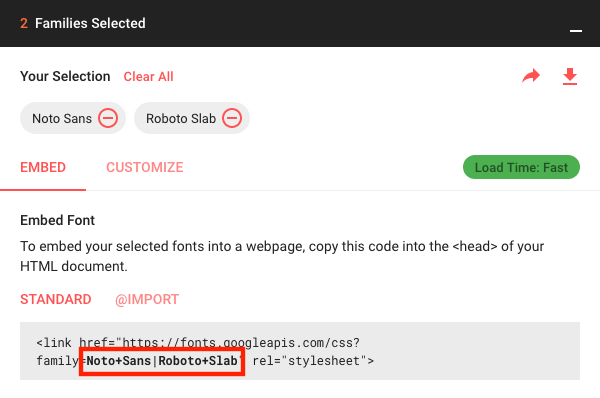

Jekyll이 실행되면 `_config.yml`에 다양한 항목을 추가하여 기본 구성을 시작할 수 있습니다. 
여기 문서 외에도 [주석이 달린 설정 파일][config]을 읽을 수 있습니다.

`_config.yml`을 변경할 때, 변경 사항이 적용되도록 Jekyll 프로세스를 다시 시작해야 합니다.
{:.note}

0. 이 무작위 시드 목록은 무작위 목록으로 toc로 대체됩니다.
{:toc}

## `url` 및 `baseurl` 설정
첫 번째로 해야 할 일은 `_config.yml` 파일에서 올바른 `url` 및 `baseurl` 값을 설정하는 것입니다.

`url`은 사이트의 도메인으로, 프로토콜(`http` 또는 `https`)을 포함합니다. 이 사이트의 경우:

~~~yml
# 파일: `_config.yml`
url: https://qwtel.com
~~~

GitHub Pages 또는 Netlify에 호스팅할 때는 이 속성을 제공할 필요가 없습니다.
{:.note}

Jekyll 블로그가 페이지의 하위 디렉토리에 호스팅되는 경우, `/`로 시작하고 `/`로 끝나지 않는 경로를 `baseurl`에 제공하세요. 예를 들어:

~~~yml
# 파일: `_config.yml`
baseurl: /hydejack
~~~

그렇지 않으면 빈 문자열 `''`을 제공합니다.

GitHub Pages 또는 Netlify에 호스팅할 때는 이 속성을 제공할 필요가 없습니다.
{:.note}

### GitHub Pages
[GitHub Pages](https://pages.github.com/)에 호스팅할 때, `url`은 `https://<username>.github.io`입니다
(사용자 정의 도메인을 사용하는 경우 제외).

`baseurl`은 호스팅하는 페이지 유형에 따라 다릅니다.

* *사용자 또는 조직 페이지*를 호스팅할 때는 빈 문자열 `''`을 사용하세요.
* *프로젝트 페이지*를 호스팅할 때는 `/<reponame>`을 사용하세요.

GitHub에서 호스팅할 수 있는 페이지 유형에 대한 자세한 내용은 [GitHub 도움말 기사](https://help.github.com/articles/user-organization-and-project-pages/)를 참조하세요.

## 강조 색상 및 사이드바 이미지 변경
Hydejack은 사이드바의 배경 이미지와 강조 색상(링크 색상, 선택 및 포커스 윤곽 등)을 선택할 수 있게 합니다.

~~~yml
# 파일: `_config.yml`
accent_image: /assets/img/sidebar-bg.jpg
accent_color: rgb(79,177,186)
~~~

텍스트가 읽기 쉬운 상태로 유지되도록 흐릿한 이미지를 사용하는 것이 좋습니다. 흐릿한 이미지를 JPG로 저장하면 파일 크기도 크게 줄어듭니다.
{:.note}

`accent_image` 속성은 기본 이미지를 제거하는 특별한 값 `none`도 허용합니다.

사이드바 이미지에 밝은 색상이 포함된 경우, 흰색 텍스트를 읽기 어려울 수 있습니다. 이 경우, `invert_sidebar: true`를 프론트 매터에 설정하여 사이드바의 텍스트 색상을 반전시키는 것을 고려해 보세요.
[프론트 매터 기본값][fmd]을 사용하여 모든 페이지에서 이를 활성화할 수 있습니다(아래 참조).

이 값들은 페이지별로 덮어쓸 수 있으며, 각 페이지에 독특한 외관을 만들 수 있습니다.
또한 [프론트 매터 기본값][fmd]을 통해 카테고리의 모든 게시물에 특정 외관을 적용할 수 있습니다. 예를 들어:

~~~yml
# 파일: `_config.yml`
defaults:
  - scope:
      path:         hydejack/
    values:
      accent_image: /assets/img/hydejack-bg.jpg
      accent_color: rgb(38,139,210)
~~~

### 테마 색상
Hydejack은 `theme_color` 속성도 지원합니다. 설정하면 사이드바의 배경색이 변경되며, [웹 앱 매니페스트][wam]에서 `theme_color` 속성이 설정됩니다. 일부 브라우저(예: 안드로이드의 Chrome)에서는 브라우저의 UI 구성 요소 색상이 변경됩니다.

~~~yml
# 파일: `_config.yml`
theme_color:  rgb(25,55,71)
~~~

`accent_*` 속성과 마찬가지로, 테마 색상은 프론트 매터에서 설정하여 페이지별로 덮어쓸 수 있습니다.

[wam]: https://web.dev/add-manifest/#theme-color

## 글꼴 변경
Hydejack은 일반 텍스트와 헤드라인의 글꼴을 설정할 수 있으며, Google Fonts에 대한 기본 지원을 제공합니다.
`_config.yml`에는 `font`, `font_heading` 및 `google_fonts`라는 세 가지 키가 있습니다.
기본값은 다음과 같습니다:

~~~yml
# 파일: `_config.yml`
font:         Noto Sans, Helvetica, Arial, sans-serif
font_heading: Roboto Slab, Helvetica, Arial, sans-serif
google_fonts: Roboto+Slab:700|Noto+Sans:400,400i,700,700i
~~~

`font` 및 `font_heading`는 유효한 CSS `font-family` 값이어야 합니다. Google Fonts를 사용할 때는 최소한 하나의 대체 글꼴을 제공하세요.

`google_fonts` 키는 Google에서 글꼴을 가져오는 데 필요한 문자열입니다.
[Google Fonts](https://fonts.google.com)에서 하나 이상의 글꼴을 선택한 후 다운로드 페이지에서 얻을 수 있습니다:

{:width="600" height="398" loading="lazy"}

### Google Fonts 제거
Google Fonts를 사용하지 않으려면, `google_fonts` 키를 `false`로 설정하여 관련된 모든 코드를 사이트에서 제거할 수 있습니다.

`no_google_fonts` 매개변수는 v9에서 제거되었으며 더 이상 효과가 없습니다.
{:.note}

## 블로그 레이아웃 선택
Hydejack에는 블로그 게시물을 표시하는 세 가지 레이아웃이 있습니다.

* [`list` 레이아웃][posts]은 제목만 표시하고 게시물을 연도별로 그룹화합니다.
* [`grid` 레이아웃][grid]\*은 PRO 버전에서만 사용할 수 있으며, 각 게시물에 대한 콘텐츠 카드(`image`)를 표시합니다.
* [`blog` 레이아웃][blog]은 전통적인 페이지네이션 레이아웃이며 각 게시물의 제목과 요약을 표시합니다.

[blog]: https://hydejack.com/blog/
[posts]: https://hydejack.com/posts/
[grid]: https://hydejack.com/blog/hydejack/

`list` 또는 `grid` 레이아웃을 사용하려면 새 마크다운 파일에 다음 프론트 매터를 추가하세요:

~~~yml
---
layout: list # 또는 `grid`
title:  Home
---
~~~

`blog` 레이아웃을 사용하려면 `Gemfile`에 `jekyll-paginate`를 추가하고 설정 파일의 `plugins` 목록에 추가해야 합니다:

~~~ruby
# 파일: `Gemfile`
gem "jekyll-paginate"
~~~

~~~yml
# 파일: `_config.yml`
plugins:
  - jekyll-paginate
~~~

설정 파일에 `paginate` 및 `paginate_path` 키도 추가해야 합니다. 예를 들어:

~~~yml
# 파일: `_config.yml`
paginate:      10
paginate_path: '/:num/'
~~~

`blog` 레이아웃은 `.html` 파일 확장자를 가진 파일에 적용되어야 하며,
`paginate_path`는 `index.html` 파일 경로와 일치해야 합니다.
위의 `paginate_path`와 일치시키려면 다음 프론트 매터가 포함된 `index.html`을 루트 디렉토리에 넣으세요:

~~~yml
# 파일: `index.html`
---
layout: blog
title: Blog
---
~~~

자세한 내용은 [Pagination](https://jekyllrb.com/docs/pagination/)을 참조하세요.

### 하위 디렉토리에서 `blog` 레이아웃 사용
`/my-blog/`와 같은 URL에서 블로그 레이아웃을 사용하려면 다음 폴더 구조를 만드세요:

~~~
├── my-blog
│   └── index.html
└── _config.yml
~~~

이전과 동일한 `index.html`을 사용하고 하위 디렉토리에 넣으세요.

~~~yml
# 파일: `my-blog/index.html`
---
layout: blog
title: Blog
---
~~~

설정 파일에서 `paginate_path`가 하위 디렉토리 이름과 일치하는지 확인하세요:

~~~yml
# 파일: `_config.yml`
paginate:      10
paginate_path: /my-blog/:num/ #!!
~~~

사이드바에 블로그 디렉토리에 대한 링크를 추가하려면 `_config.yml` 파일의 `links` 섹션에 다음을 추가하세요:

~~~yml
# 파일: `_config.yml`
links:
  my_blog:
    title: My Blog
    url: /my-blog/
~~~
